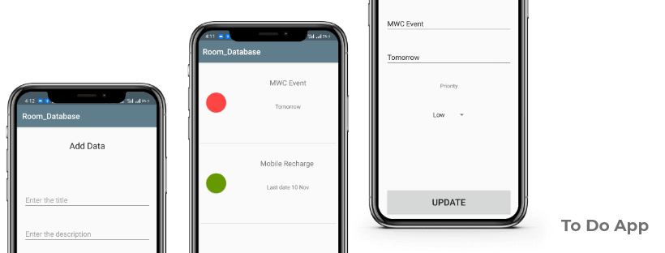

  

## About The Project
Jira-personal helps to maintain your tasks efficiently by adding priorities and status with it.
Easy to create, update and long press on task to delete.

### Built With

* Android Studio

<!-- GETTING STARTED -->
### Installation

1. Clone the repo.

2. Open the project in IDE.

3. Delete the Screenshot folder.

4. Build and run the app on your device.

<!-- CONTRIBUTING -->
## Contributing

Contributions are what makes the open source community such an amazing place to be learn, inspire, and create. Any contributions you make are **greatly appreciated**.

1. Fork the Project
2. Create your Feature Branch 
3. Commit your Changes
4. Push to the Branch
5. Open a Pull Request

<!-- CONTACT -->
## Contact

[Jaspreet Singh](https://www.linkedin.com/in/jaspreetsidhu13/)
